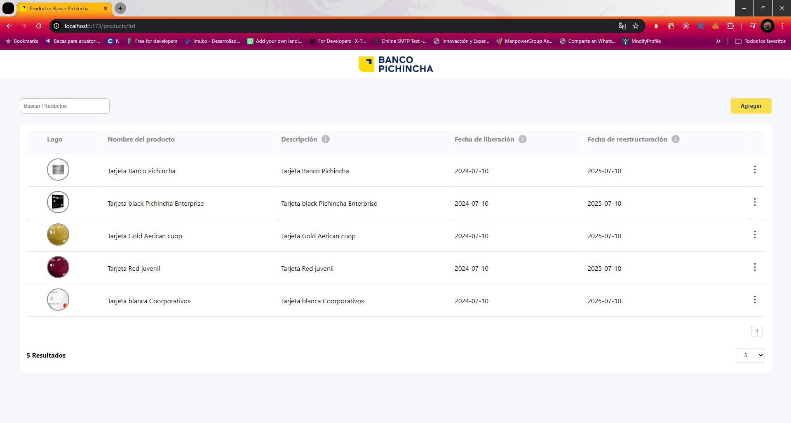
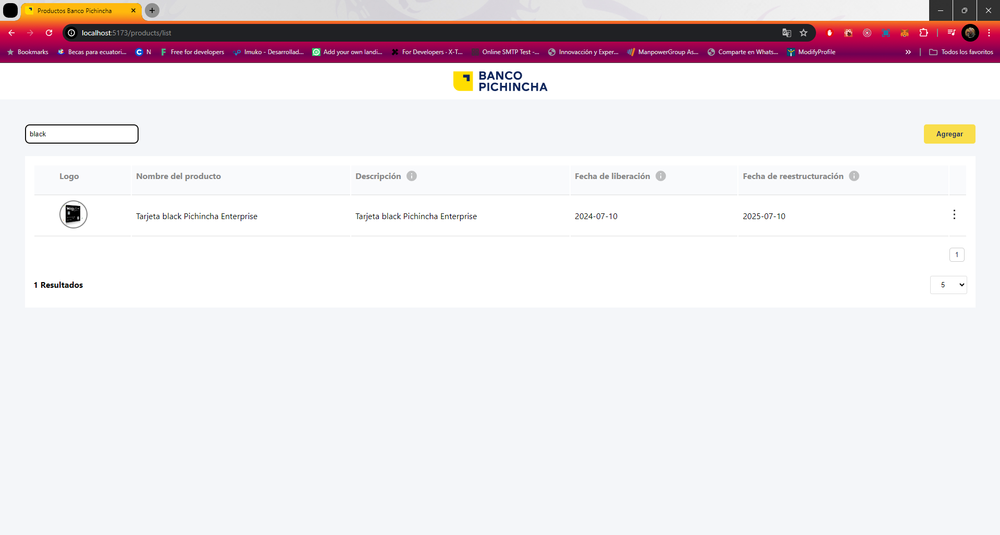
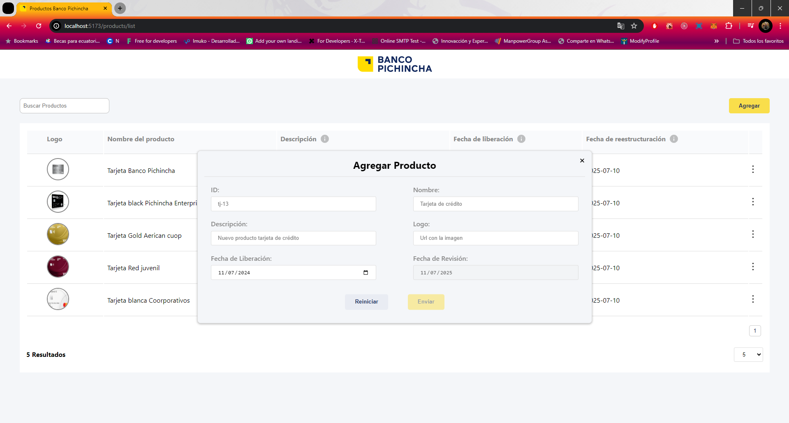
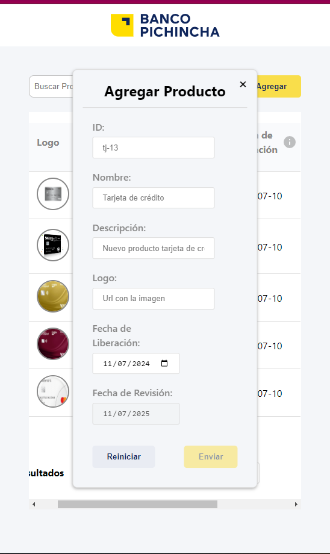
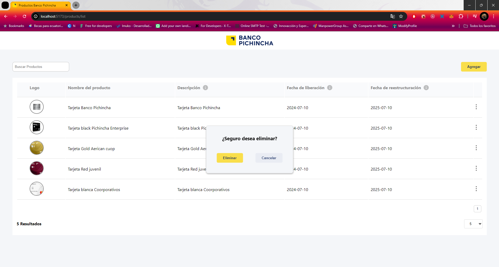

## Bp-FrontendTest

    Crud servicios financieros listados para Test frontend

## Capturas de Pantalla

Products

SearchBar

Create Form 

Responsive View

Edit/Delete Actions

Delete popup 

## Instalación

 Pasos para instalar y correr el proyecto:

    npm install

    npm run dev

Correr los Test de la aplicacion 

    npm run test

## Importante

    Asegurarse de correr el  servidor backend ubicado en la carpeta repo-interview-main para acceder a los datos

    npm install

    npm run start:dev

## Tecnologías

- React
- TypeScript
- Jest